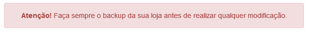

### **Módulo para plataforma Magento**

Versão do módulo: 1.3.6

Compatibilidade com Magento: **1.9.x**

Links úteis:

- [Magento Marketplace][1]
- [Painel administrativo][2]
- [suporte@freterapido.com][3]

-------------

### IMPORTANTE

Este módulo é apenas um referencial de integração e cabe ao cliente a função de configurá-lo e adaptá-lo a sua respectiva loja, levando em conta as particularidades e conflitos que podem surgir durante o processo de integração.

A Frete Rápido não mantem e/ou oferece suporte para a integração com o **Magento**, disponibilizamos o módulo padrão que atente a modalidade de envio simples.

**Este módulo não opera Dropshipphig!**

Caso seja necessário adaptações deste módulo para atender a sua loja, é possível alterar o código fonte, desde que atenda a [API da Frete Rápido][9]. E [neste link][8] você encontra a documentação de orientações do **Magento**.

A Frete Rápido não se responsabiliza por eventualidades advindas deste módulo.

--------------

### Instalação

>**<i class="icon-attention"></i> ATENÇÃO!** Recomendamos que seja feito backup da sua loja antes de realizar qualquer instalação. A instalação desse módulo é de inteira responsabilidade do lojista.

- [Baixe a última versão aqui][4],  descompacte o conteúdo do arquivo zip dentro da pasta "app" da sua loja Magento.
- Verifique se o arquivo **local.xml** está habilitado na pasta "app/etc" da sua loja Magento. Caso não esteja, é só renomear o arquivo **local.xml.sample** para **local.xml**.
- Acesse a área administrativa de sua loja e limpe o cache em: Sistema > Gerenciamento de Cache.

----------

# Documentação Frete Rápido

##  - [Configurações iniciais](https://freterapido.com/wiki/docs/integrations/magento_1.9/#configuracoes-iniciais).

1. [Configuração do módulo](https://freterapido.com/wiki/docs/integrations/magento_1.9/#_1-configuracao-do-modulo).

2. [Origem remetente](https://freterapido.com/wiki/docs/integrations/magento_1.9/#_2-origem-remetente).

3. [Medidas e Prazo de envio](https://freterapido.com/wiki/docs/integrations/magento_1.9/#_3-medidas-e-prazo-de-envio).

4. [Categorias](https://freterapido.com/wiki/docs/integrations/magento_1.9/#_4-categorias).

##  - [Contratação do Frete](https://freterapido.com/wiki/docs/integrations/magento_1.9/#contratacao-do-frete).

##  - [Cálculo do frete na página do produto](https://freterapido.com/wiki/docs/integrations/magento_1.9/#cotacoes-de-frete-na-pagina-do-produto).

##  - [Webhook](https://freterapido.com/wiki/docs/integrations/magento_1.9/#Webhook).

##  - [Considerações finais](https://freterapido.com/wiki/docs/integrations/magento_1.9/#consideracoes-finais).

### Contribuições
Encontrou algum bug ou tem sugestões de melhorias no código? Sensacional! Não se acanhe, nos envie um pull request com a sua alteração e ajude este projeto a ficar ainda melhor.

1. Faça um "Fork"
2. Crie seu branch para a funcionalidade: ` $ git checkout -b feature/nova-funcionalidade`
3. Faça o commit suas modificações: ` $ git commit -am "adiciona nova funcionalidade"`
4. Faça o push para a branch: ` $ git push origin feature/nova-funcionalidade`
5. Crie um novo Pull Request

--------

### Licença

[MIT][5]

[1]: https://marketplace.magento.com/freterapido-frete-rapido.html "Magento Connect"
[2]: https://painel.freterapido.com/?origin=doc_magento "Painel do Frete Rápido"
[3]: mailto:suporte@freterapido.com "Contato uma galera super gente fina :)"
[4]: https://github.com/freterapido/freterapido_magento/archive/master.zip
[5]: https://github.com/freterapido/freterapido_magento/blob/master/LICENSE
[6]: https://github.com/freterapido/freterapido_magento/blob/master/README.md
[7]: https://github.com/freterapido/freterapido_magento/blob/master/README_EN.md
[8]: http://devdocs.magento.com/
[9]: https://dev.freterapido.com
